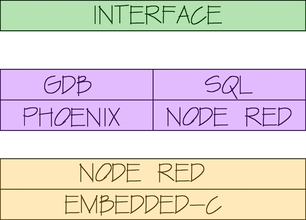
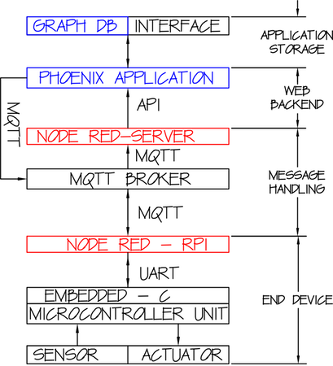

### Smart Application Development Using Graph Database Modeling and High Availability Web Services

 
Holm Smidt, **Matsu Thornton**, Reza Ghorbani  
University of Hawaii at Manoa

---

## Overview

- Motivation |
- Objectives |
- Development Stack |
- Use Case:   HICSS-51 Registration System |

---

### Motivation

+++

### A framework that is...

- easy to use |
- productive (fast) |
- scalable |
- easy to   prototype,   troubleshoot, &   deploy |

+++

### Methodology

---

### Layered Architecture

+++

### Communication Flow

+++

---

## Use Case
### HICSS 51 Registration System

---

+++

### What happens when new technologies come in?

- computational power &rarr; big data & deep learning |
- cheaper hardware &rarr; low-cost sensors  |
- enhanced network &rarr; IoT applications |
---

## Industry Examples

+++

#### SAP Hana: Live Construction Site

<iframe width="560" height="315" src="https://www.youtube.com/embed/xNE5Goby2dc" frameborder="0" gesture="media" allow="encrypted-media" allowfullscreen></iframe>

+++

#### ABB and IBM Watson IoT

<iframe width="560" height="315" src="https://www.youtube.com/embed/-4CazFUHgDs" frameborder="0" gesture="media" allow="encrypted-media" allowfullscreen></iframe>

+++

#### Tantalum: IoT Connected Cars

[https://www.tantalumcorporation.com/open-platform/](https://www.tantalumcorporation.com/open-platform/)

+++

#### SAP: Connected Stadium

<iframe width="560" height="315" src="https://www.youtube.com/embed/Lx0q5XjR18Q" frameborder="0" gesture="media" allow="encrypted-media" allowfullscreen></iframe>

---

## HICSS-51

### How can we apply new technologies to academic conferences?

+++

### Motivation

- _"Better understand how and why people attend sessions..."   Conference Chair_ |
- _"Tired of running around and manually counting attendees... "   Conference Organizer_|
- _"What do I get out of coming to the conference? "   Attendee_ |

+++

### BI Questions

- Are there patterns in the way people attend workshops? |
- Are there cliques at academic conferences?  |
- Can we provide an improved attendee experience? |
- Can we help organizers plan for upcoming conferences? |

+++

### Approach

- **RFID Tracking System**  |
- **Real-Time interface with visual analytics** |
- **Visual analytics tools for organizers (Tableau)** |
- **Machine Learning &rarr; community detection & pattern recognition (Python, R, Rapidminer)** |

+++

+++

---
### Takeaway  ...

... BI & BA tools are evolving rapidly:

- Exploit tools that you know; |
- Explore new methods and tools along the way; |
- Always design with intention and passion; |
- Keep it simple. |

+++

## Thank you!
